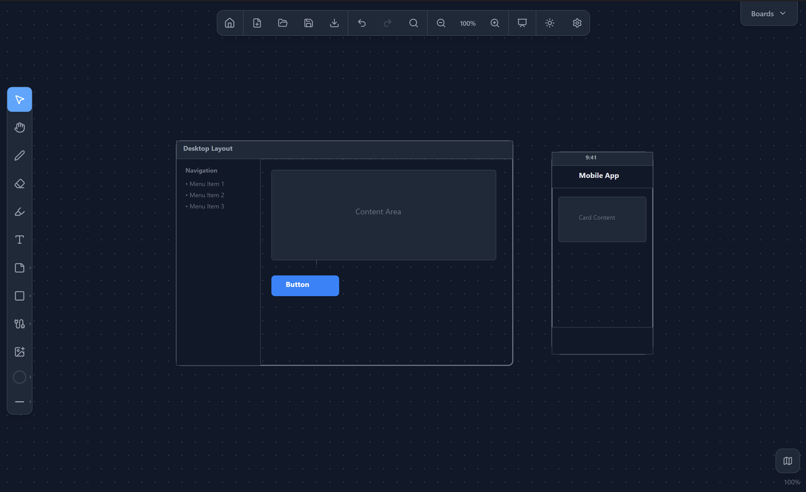

<p align="center">
  
</p>

<h1 align="center">DraftInk</h1>

<p align="center">
A lightweight, offline-first whiteboard application built with <a href="https://tauri.app">Tauri</a> that lets you draw, write text, add shapes, and organize ideas on an infinite canvas. Fast, native desktop experience — no internet connection or cloud account required.
</p>

<p align="center">
  
</p>

## Features

- **Infinite Canvas** — Pan and zoom freely across an unbounded drawing surface
- **Freehand Drawing** — Pen tool with stroke smoothing and pressure sensitivity support for stylus/pen tablets
- **Shape Tools** — Rectangle, ellipse, line, and arrow with configurable fill and stroke
- **Text Blocks** — Inline-editable text with font, size, alignment, bold/italic controls
- **Sticky Notes** — Color-coded sticky notes for quick annotations
- **Smart Connectors** — Link elements together with straight, elbow, or curved connector lines
- **Highlighter** — Semi-transparent strokes for marking up content
- **Image Embedding** — Drag-and-drop, paste, or insert images from file
- **Selection & Transform** — Select, move, resize, rotate, and delete elements; multi-select with lasso
- **Layer Controls** — Bring forward/backward, send to front/back
- **Clipboard** — Cut, copy, paste, and duplicate elements
- **Undo/Redo** — Full history stack for all canvas operations
- **Snap-to-Grid & Alignment Guides** — Smart snapping for precise layouts
- **Multi-Board Support** — Create and switch between multiple boards in a single session
- **Search** — Find text content across the current board or all boards
- **Template Gallery** — Start from preset board layouts
- **Presentation Mode** — Full-screen presentation with laser pointer tool
- **Minimap** — Overlay for quick canvas navigation
- **Export** — PNG, SVG, and PDF export
- **File Format** — Custom `.inkboard` JSON format for easy versioning
- **Dark & Light Themes** — System-aware with manual toggle
- **Keyboard Shortcuts** — Full shortcut coverage for power users
- **Auto-Updater** — Built-in update checking and installation

## Tech Stack

| Layer | Technology |
|-------|-----------|
| Desktop shell | [Tauri v2](https://v2.tauri.app) |
| Frontend | [React 19](https://react.dev) + [TypeScript](https://www.typescriptlang.org) |
| Rendering | HTML5 Canvas 2D (double-buffered offscreen strategy) |
| State management | [Zustand](https://zustand.docs.pmnd.rs) (domain-separated stores) |
| Styling | [Tailwind CSS v4](https://tailwindcss.com) via Vite plugin |
| Icons | [Lucide React](https://lucide.dev) |
| Backend | Rust (serde, anyhow, thiserror) |
| File dialogs | tauri-plugin-dialog |
| Auto-update | tauri-plugin-updater |
| Unit tests | [Vitest](https://vitest.dev) + Testing Library |
| E2E tests | [WebDriverIO](https://webdriver.io) |
| Linting | ESLint + Prettier |

## Prerequisites

- **Rust toolchain** — Install via [rustup](https://rustup.rs) (stable channel)
- **Node.js** — v18 or later
- **pnpm** — install via `npm install -g pnpm` or see [pnpm.io](https://pnpm.io/installation)
- **System dependencies** — see the [Tauri prerequisites guide](https://v2.tauri.app/start/prerequisites/) for your platform (on Windows: WebView2; on Linux: webkit2gtk and related packages)

## Getting Started

### Clone and install

```bash
git clone https://github.com/davidelvar/DraftInk.git
cd DraftInk
pnpm install
```

### Development

Start the app in development mode with hot-reload:

```bash
pnpm tauri dev
```

This runs the Vite dev server on `http://localhost:1420` and launches the Tauri window.

### Run frontend only (no Tauri shell)

```bash
pnpm dev
```

### Production build

Build the distributable desktop app:

```bash
pnpm tauri build
```

Output binaries are placed in `src-tauri/target/release/bundle/`.

## Scripts

| Script | Description |
|--------|------------|
| `pnpm dev` | Start Vite dev server |
| `pnpm build` | Type-check and build frontend |
| `pnpm tauri dev` | Launch full Tauri app in dev mode |
| `pnpm tauri build` | Build production desktop app |
| `pnpm test` | Run unit tests (Vitest) |
| `pnpm test:watch` | Run tests in watch mode |
| `pnpm test:coverage` | Run tests with V8 coverage |
| `pnpm test:e2e` | Run E2E tests (WebDriverIO) |
| `pnpm lint` | Lint with ESLint |
| `pnpm lint:fix` | Lint and auto-fix |
| `pnpm format` | Format with Prettier |
| `pnpm format:check` | Check formatting |
| `pnpm check` | Full check (tsc + eslint + prettier) |

## Project Structure

```
draftink/
├── src/                        # Frontend source
│   ├── App.tsx                 # Root component
│   ├── main.tsx                # Entry point
│   ├── index.css               # Global styles + CSS custom properties
│   ├── canvas/                 # Rendering engine
│   │   ├── InfiniteCanvas.tsx  # Main canvas component
│   │   ├── viewport.ts        # Pure viewport transform math
│   │   ├── useViewport.ts     # React hook for viewport state
│   │   ├── renderElements.ts  # Element rendering with pressure-aware strokes
│   │   ├── renderSelection.ts # Selection box and handles rendering
│   │   ├── hitTest.ts         # Element picking / click detection
│   │   ├── quadtree.ts        # Spatial index for fast element lookup
│   │   ├── smoothing.ts       # Freehand stroke smoothing (Ramer-Douglas-Peucker)
│   │   ├── grid.ts            # Background grid rendering
│   │   ├── snapping.ts        # Snap-to-grid and alignment guides
│   │   └── connectors.ts      # Connector path computation
│   ├── components/             # UI components
│   │   ├── Toolbar.tsx         # Drawing tool and settings sidebar
│   │   ├── TopBar.tsx          # File ops, undo/redo, zoom, theme
│   │   ├── BoardPanel.tsx      # Multi-board switcher strip
│   │   ├── HomeScreen.tsx      # Landing screen with recent boards
│   │   ├── ContextMenu.tsx     # Right-click context menu
│   │   ├── SearchPanel.tsx     # Search modal (in-board + cross-board)
│   │   ├── Minimap.tsx         # Canvas minimap overlay
│   │   ├── TemplateGallery.tsx # Preset board templates
│   │   ├── SettingsPanel.tsx   # App settings
│   │   ├── ShortcutsOverlay.tsx# Keyboard shortcuts help
│   │   ├── PresentationControls.tsx # Presentation mode UI
│   │   ├── UndoToast.tsx       # Undo action notification
│   │   └── UpdateChecker.tsx   # Auto-update notification
│   ├── store/                  # Zustand state stores
│   │   ├── documentStore.ts    # Canvas elements / document model
│   │   ├── boardStore.ts       # Multi-board management
│   │   ├── historyStore.ts     # Undo/redo history stack
│   │   ├── toolStore.ts        # Active tool and tool settings
│   │   ├── fileStore.ts        # File save/open state
│   │   ├── themeStore.ts       # Light/dark/system theme
│   │   ├── settingsStore.ts    # App preferences (pressure, toolbar, etc.)
│   │   ├── viewportUIStore.ts  # Viewport UI state (zoom, grid, snap)
│   │   └── searchStore.ts      # Search query and results
│   ├── hooks/                  # Custom React hooks
│   │   └── useKeyboardShortcuts.ts # Centralized keyboard shortcut handler
│   ├── types/                  # Shared TypeScript types
│   │   └── document.ts         # Canvas element type definitions
│   ├── utils/                  # Utility modules
│   │   ├── id.ts               # Unique ID generation
│   │   ├── export.ts           # Client-side export logic
│   │   └── image.ts            # Image processing helpers
│   └── templates/              # Board template definitions
│       └── index.ts
├── src-tauri/                  # Rust backend
│   ├── src/
│   │   ├── main.rs             # Entry point
│   │   └── lib.rs              # Tauri command handlers
│   ├── Cargo.toml              # Rust dependencies
│   ├── tauri.conf.json         # Tauri app configuration
│   ├── capabilities/           # Tauri v2 permissions
│   └── icons/                  # App icons (all platforms)
├── e2e/                        # WebDriverIO E2E tests
├── .github/workflows/          # CI/CD (ci.yml, release.yml)
├── index.html                  # HTML entry point
├── vite.config.ts              # Vite configuration
├── vitest.config.ts            # Vitest configuration
├── tsconfig.json               # TypeScript configuration
├── eslint.config.js            # ESLint flat config
└── package.json
```

## .inkboard File Format

DraftInk saves boards in a custom JSON-based `.inkboard` format:

```json
{
  "metadata": {
    "name": "My Board",
    "createdAt": "2026-01-15T10:30:00.000Z",
    "updatedAt": "2026-03-14T14:22:00.000Z",
    "formatVersion": "1.0.0"
  },
  "elements": [
    {
      "id": "abc123",
      "type": "freehand",
      "position": { "x": 100, "y": 200 },
      "rotation": 0,
      "zIndex": 1,
      "locked": false,
      "visible": true,
      "stroke": { "color": "#1f2937", "width": 2, "opacity": 1 },
      "points": [
        { "x": 0, "y": 0, "pressure": 0.5 },
        { "x": 10, "y": 5, "pressure": 0.7 }
      ],
      "isEraser": false,
      "isHighlighter": false
    }
  ]
}
```

The `formatVersion` field enables forward-compatible migrations as new element types are added. All coordinates are stored in canvas-space, not screen-space.

**Supported element types:** `freehand`, `text`, `rectangle`, `ellipse`, `line`, `arrow`, `image`, `sticky`, `connector`

## Keyboard Shortcuts

### Tools

| Shortcut | Action |
|----------|--------|
| `V` | Select tool |
| `P` | Pen tool |
| `E` | Eraser tool |
| `H` | Highlighter tool |
| `T` | Text tool |
| `R` | Rectangle tool |
| `O` | Ellipse tool |
| `L` | Line tool |
| `A` | Arrow tool |
| `N` | Sticky note tool |
| `C` | Connector tool |
| `Ctrl+Shift+I` | Insert image |

### File

| Shortcut | Action |
|----------|--------|
| `Ctrl+N` | New board |
| `Ctrl+O` | Open file |
| `Ctrl+S` | Save |
| `Ctrl+Shift+S` | Save as |
| `Ctrl+Shift+E` | Export as PNG |

### Edit

| Shortcut | Action |
|----------|--------|
| `Ctrl+Z` | Undo |
| `Ctrl+Shift+Z` / `Ctrl+Y` | Redo |
| `Ctrl+X` | Cut |
| `Ctrl+C` | Copy |
| `Ctrl+V` | Paste |
| `Ctrl+D` | Duplicate |
| `Ctrl+A` | Select all |
| `Delete` / `Backspace` | Delete selected |
| `Escape` | Deselect all |
| `Ctrl+F` | Search in board |
| `Ctrl+Shift+F` | Search all boards |

### Layers

| Shortcut | Action |
|----------|--------|
| `Ctrl+]` | Bring forward |
| `Ctrl+[` | Send backward |
| `Ctrl+Shift+]` | Bring to front |
| `Ctrl+Shift+[` | Send to back |

### View

| Shortcut | Action |
|----------|--------|
| `Ctrl+=` | Zoom in |
| `Ctrl+-` | Zoom out |
| `Ctrl+0` | Reset zoom |
| `Ctrl+G` | Toggle grid |
| `Ctrl+Shift+G` | Toggle snap-to-grid |
| `M` | Toggle minimap |
| `F5` | Presentation mode |
| `Space` + drag | Pan canvas |
| `?` | Show shortcuts help |

## License

MIT — see [LICENSE](LICENSE) for details.
